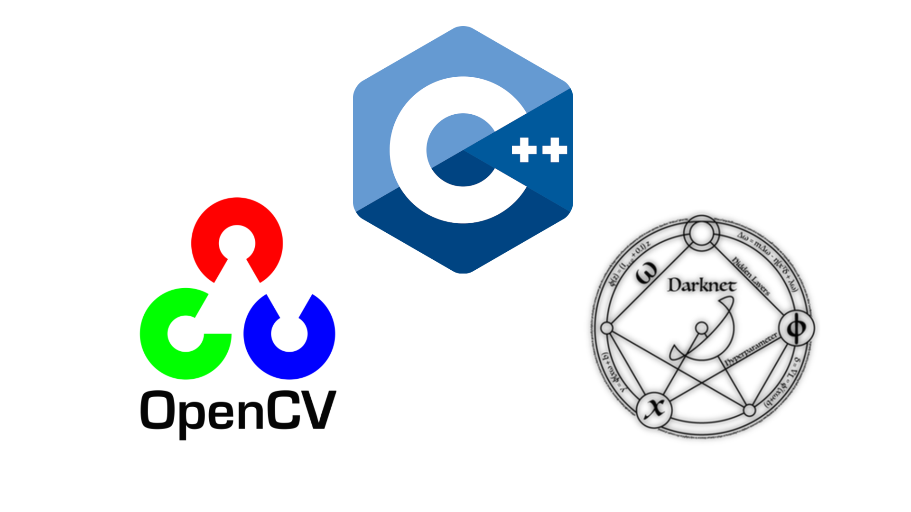

# Introduzione

## Un problema $\Rightarrow$ Una soluzione
Per lo svolgimento del nostro progetto abbiamo preso in considerazione uno dei piu' noti problemi delle grandi citta': il traffico. 

Abbiamo quindi deciso di creare un sistema Iot in grado di monitorare lo scorrimento in diverse strade della citta' e di poter comunicare tramite un applicazione e in tempo reale ogni anomalia che puo' portare alla creazione di code ed ingorghi.

## Componenti del sistema
 - **Server di riconoscimento e tracciamento**

    Riceve l'input video e lo elabora scrivendo il riscutato delle elaborazioni sul Database
 - **Database**

    Strumento usato per la persistenza dei dati nel sistemas
 - **Server http/php** 

    Fornisce un interfaccia al Database per l'applicazione Android (JSON)
 - **Applicazione** 

    Interfaccia Utente

# Tracciamento e riconoscimento

## Tech Stack

## Tracciamento e Riconoscimento

**Funzionalita'**

 - Interfaccia di gestione delle telecamere

 - Ricezione del dello stream video

 - Tracciamento e Riconoscimento dei veicoli

 - Manipolazione ed elaborazione dei dati delle telecamere

# Database / Server PHP

## Tech Stack

## Storing e comunicazione

**Funzionalita'**

 - Conservare i dati delle rilevazioni

 - Conservare dati relativi alle telecamere

 - Comunicazione dei dati all'App

# Applicazione

## Tech Stack

## Applicazione Android

**Funzionalita'**

 - Fornire un interfaccia grafica all'utente

 - Accesso rapido ed intuitivo ai dati